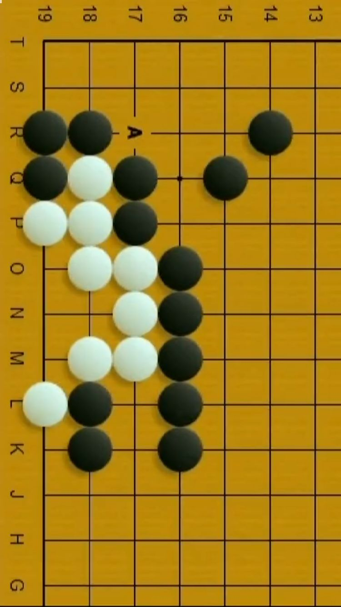
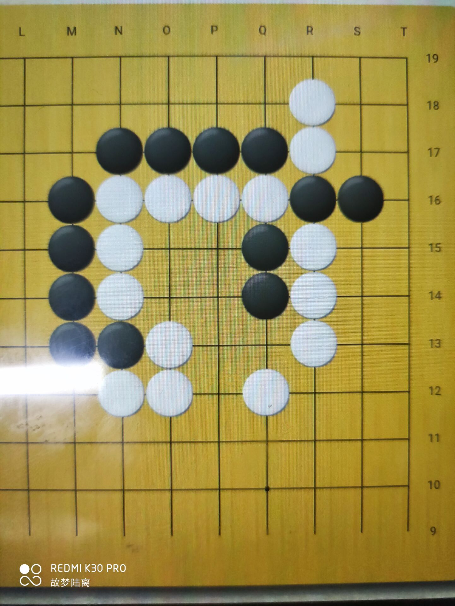
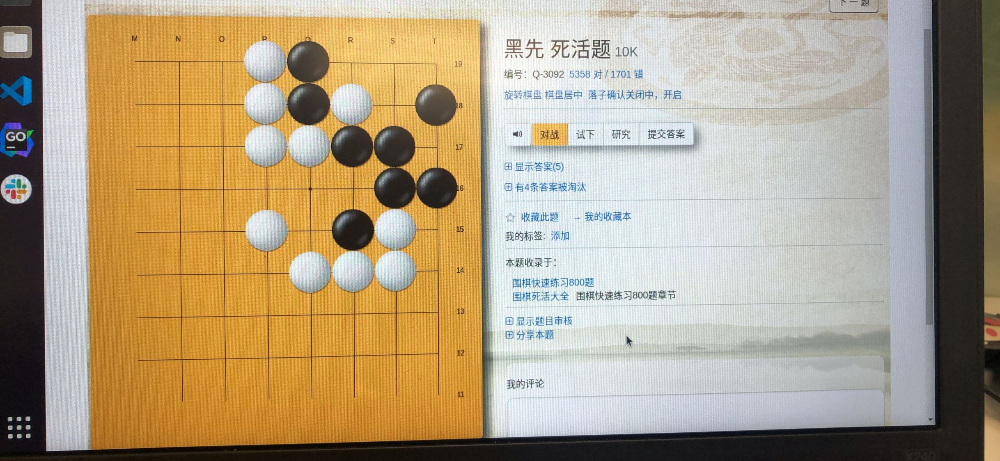
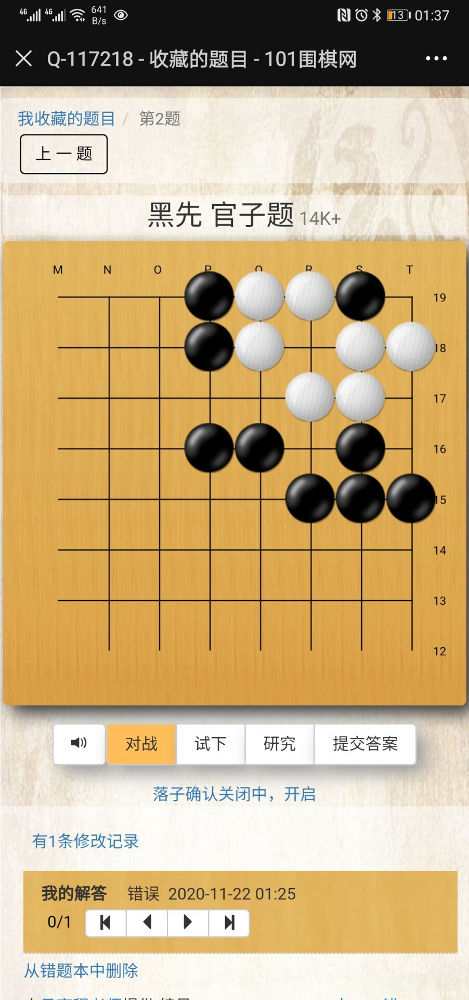

# 棋盘识别需求

## 1.项目背景

需要在iOS 上进行一个拍围棋棋盘转换成二维数组的功能

视觉识别 openvc 棋盘棋子识别YOLO 都在ios终端上进行。

## 2.现有情况

有人给做了个 python版 识别不准确。只能识别19*19 棋盘

## 3.详细需求

需要识别 多种完整棋盘（不同路数，可能是长方形可能是正方形）

移植成ccp 在iOS 上能使用

识别部分棋盘。



==>

```
00000003
00000003
11000103
12101003
22100003
02210003
00210003
02210003
21010003
01010003
00000003
00000003
00000003
33333333
```




===》这图有个亮点。

```

```



==>

```
30021000
30021201
30022110
30000011
30020120
30002220
30000000
30000000
33333333
```



==>

```
30012210
30012011
30000110
30000111
30000000
30000000
33333333
```


总结规律。

1.黑子 是2

2.白是1

3.空是0

4.残次棋盘 边线 识别成3